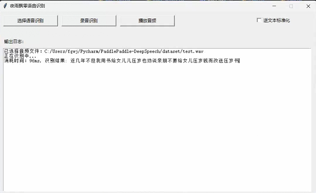

# 本地预测

我们可以使用这个脚本使用模型进行预测，如果如何还没导出模型，需要执行[导出模型](./export_model.md)操作把模型参数导出为预测模型，通过传递音频文件的路径进行识别，通过参数`--wav_path`指定需要预测的音频路径。支持中文数字转阿拉伯数字，将参数`--is_itn`设置为True即可。
```shell script
python infer_path.py --wav_path=./dataset/test.wav
```

输出结果：
```
[2022-10-28 22:48:02.777229 INFO   ] utils:print_arguments:19 - ----------- 额外配置参数 -----------
[2022-10-28 22:48:02.778229 INFO   ] utils:print_arguments:21 - configs: configs/conformer_online_zh.yml
[2022-10-28 22:48:02.778229 INFO   ] utils:print_arguments:21 - is_itn: False
[2022-10-28 22:48:02.778229 INFO   ] utils:print_arguments:21 - is_long_audio: False
[2022-10-28 22:48:02.778229 INFO   ] utils:print_arguments:21 - model_path: models/{}_{}/infer/
[2022-10-28 22:48:02.778229 INFO   ] utils:print_arguments:21 - pun_model_dir: models/pun_models/
[2022-10-28 22:48:02.778229 INFO   ] utils:print_arguments:21 - real_time_demo: False
[2022-10-28 22:48:02.778229 INFO   ] utils:print_arguments:21 - use_gpu: True
[2022-10-28 22:48:02.778229 INFO   ] utils:print_arguments:21 - use_pun: False
[2022-10-28 22:48:02.778229 INFO   ] utils:print_arguments:21 - wav_path: dataset/test.wav
[2022-10-28 22:48:02.778229 INFO   ] utils:print_arguments:22 - ------------------------------------------------
[2022-10-28 22:48:02.778229 INFO   ] utils:print_arguments:23 - ----------- 配置文件参数 -----------
[2022-10-28 22:48:02.778229 INFO   ] utils:print_arguments:26 - ctc_beam_search_decoder_conf:
[2022-10-28 22:48:02.778229 INFO   ] utils:print_arguments:28 - 	alpha: 2.2
[2022-10-28 22:48:02.778229 INFO   ] utils:print_arguments:28 - 	beam_size: 300
[2022-10-28 22:48:02.778229 INFO   ] utils:print_arguments:28 - 	beta: 4.3
[2022-10-28 22:48:02.778229 INFO   ] utils:print_arguments:28 - 	cutoff_prob: 0.99
[2022-10-28 22:48:02.778229 INFO   ] utils:print_arguments:28 - 	cutoff_top_n: 40
[2022-10-28 22:48:02.778229 INFO   ] utils:print_arguments:28 - 	language_model_path: lm/zh_giga.no_cna_cmn.prune01244.klm
[2022-10-28 22:48:02.778229 INFO   ] utils:print_arguments:28 - 	num_processes: 10
[2022-10-28 22:48:02.779232 INFO   ] utils:print_arguments:26 - dataset_conf:
[2022-10-28 22:48:02.779232 INFO   ] utils:print_arguments:28 - 	batch_size: 32
[2022-10-28 22:48:02.779232 INFO   ] utils:print_arguments:28 - 	dataset_vocab: dataset/vocabulary.txt
[2022-10-28 22:48:02.779232 INFO   ] utils:print_arguments:28 - 	manifest_type: txt
[2022-10-28 22:48:02.779232 INFO   ] utils:print_arguments:28 - 	max_duration: 20
[2022-10-28 22:48:02.779232 INFO   ] utils:print_arguments:28 - 	mean_istd_path: dataset/mean_istd.json
[2022-10-28 22:48:02.779232 INFO   ] utils:print_arguments:28 - 	min_duration: 0.5
[2022-10-28 22:48:02.779232 INFO   ] utils:print_arguments:28 - 	noise_manifest_path: dataset/manifest.noise
[2022-10-28 22:48:02.779232 INFO   ] utils:print_arguments:28 - 	num_workers: 4
[2022-10-28 22:48:02.779232 INFO   ] utils:print_arguments:28 - 	test_manifest: dataset/manifest.test
[2022-10-28 22:48:02.779232 INFO   ] utils:print_arguments:28 - 	train_manifest: dataset/manifest.train
[2022-10-28 22:48:02.779232 INFO   ] utils:print_arguments:30 - decoder: ctc_beam_search
[2022-10-28 22:48:02.779232 INFO   ] utils:print_arguments:26 - decoder_conf:
[2022-10-28 22:48:02.779232 INFO   ] utils:print_arguments:28 - 	attention_heads: 4
[2022-10-28 22:48:02.780200 INFO   ] utils:print_arguments:28 - 	dropout_rate: 0.1
[2022-10-28 22:48:02.780200 INFO   ] utils:print_arguments:28 - 	linear_units: 2048
[2022-10-28 22:48:02.780200 INFO   ] utils:print_arguments:28 - 	num_blocks: 6
[2022-10-28 22:48:02.780200 INFO   ] utils:print_arguments:28 - 	positional_dropout_rate: 0.1
[2022-10-28 22:48:02.780200 INFO   ] utils:print_arguments:28 - 	self_attention_dropout_rate: 0.0
[2022-10-28 22:48:02.780200 INFO   ] utils:print_arguments:28 - 	src_attention_dropout_rate: 0.0
[2022-10-28 22:48:02.780200 INFO   ] utils:print_arguments:26 - encoder_conf:
[2022-10-28 22:48:02.780200 INFO   ] utils:print_arguments:28 - 	activation_type: swish
[2022-10-28 22:48:02.780200 INFO   ] utils:print_arguments:28 - 	attention_dropout_rate: 0.0
[2022-10-28 22:48:02.780200 INFO   ] utils:print_arguments:28 - 	attention_heads: 4
[2022-10-28 22:48:02.780200 INFO   ] utils:print_arguments:28 - 	cnn_module_kernel: 15
[2022-10-28 22:48:02.780200 INFO   ] utils:print_arguments:28 - 	dropout_rate: 0.1
[2022-10-28 22:48:02.780200 INFO   ] utils:print_arguments:28 - 	input_layer: conv2d
[2022-10-28 22:48:02.780200 INFO   ] utils:print_arguments:28 - 	linear_units: 2048
[2022-10-28 22:48:02.780200 INFO   ] utils:print_arguments:28 - 	normalize_before: True
[2022-10-28 22:48:02.780200 INFO   ] utils:print_arguments:28 - 	num_blocks: 12
[2022-10-28 22:48:02.780200 INFO   ] utils:print_arguments:28 - 	output_size: 256
[2022-10-28 22:48:02.781200 INFO   ] utils:print_arguments:28 - 	pos_enc_layer_type: rel_pos
[2022-10-28 22:48:02.781200 INFO   ] utils:print_arguments:28 - 	positional_dropout_rate: 0.1
[2022-10-28 22:48:02.781200 INFO   ] utils:print_arguments:28 - 	use_cnn_module: True
[2022-10-28 22:48:02.781200 INFO   ] utils:print_arguments:30 - metrics_type: cer
[2022-10-28 22:48:02.781200 INFO   ] utils:print_arguments:26 - model_conf:
[2022-10-28 22:48:02.781200 INFO   ] utils:print_arguments:28 - 	ctc_weight: 0.3
[2022-10-28 22:48:02.781200 INFO   ] utils:print_arguments:28 - 	length_normalized_loss: False
[2022-10-28 22:48:02.781200 INFO   ] utils:print_arguments:28 - 	lsm_weight: 0.1
[2022-10-28 22:48:02.781200 INFO   ] utils:print_arguments:28 - 	reverse_weight: 0.0
[2022-10-28 22:48:02.781200 INFO   ] utils:print_arguments:26 - optimizer_conf:
[2022-10-28 22:48:02.781200 INFO   ] utils:print_arguments:28 - 	learning_rate: 0.001
[2022-10-28 22:48:02.781200 INFO   ] utils:print_arguments:28 - 	warmup_steps: 25000
[2022-10-28 22:48:02.781200 INFO   ] utils:print_arguments:28 - 	weight_decay: 1e-6
[2022-10-28 22:48:02.781200 INFO   ] utils:print_arguments:26 - preprocess_conf:
[2022-10-28 22:48:02.781200 INFO   ] utils:print_arguments:28 - 	feature_method: fbank
[2022-10-28 22:48:02.781200 INFO   ] utils:print_arguments:28 - 	n_mels: 80
[2022-10-28 22:48:02.781200 INFO   ] utils:print_arguments:28 - 	n_mfcc: 40
[2022-10-28 22:48:02.781200 INFO   ] utils:print_arguments:28 - 	sample_rate: 16000
[2022-10-28 22:48:02.782199 INFO   ] utils:print_arguments:28 - 	target_dB: -20
[2022-10-28 22:48:02.782199 INFO   ] utils:print_arguments:28 - 	use_dB_normalization: True
[2022-10-28 22:48:02.782199 INFO   ] utils:print_arguments:26 - train_conf:
[2022-10-28 22:48:02.782199 INFO   ] utils:print_arguments:28 - 	accum_grad: 4
[2022-10-28 22:48:02.795200 INFO   ] utils:print_arguments:28 - 	grad_clip: 5.0
[2022-10-28 22:48:02.795200 INFO   ] utils:print_arguments:28 - 	log_interval: 100
[2022-10-28 22:48:02.795200 INFO   ] utils:print_arguments:28 - 	max_epoch: 100
[2022-10-28 22:48:02.795200 INFO   ] utils:print_arguments:30 - use_model: conformer_online
[2022-10-28 22:48:02.795200 INFO   ] utils:print_arguments:31 - ------------------------------------------------
======================================================================
初始化解码器...
language model: is_character_based = 1, max_order = 5, dict_size = 0
初始化解码器完成!
======================================================================
消耗时间：101, 识别结果: 近几年不但我用书给女儿儿压岁也劝说亲朋不要给女儿压岁钱而改送压岁书, 得分: 94
```

## 长语音预测

通过参数`--is_long_audio`可以指定使用长语音识别方式，这种方式通过VAD分割音频，再对短音频进行识别，拼接结果，最终得到长语音识别结果。
```shell script
python infer_path.py --wav_path=./dataset/test_long.wav --is_long_audio=True
```

输出结果：
```
······
======================================================================
初始化解码器...
language model: is_character_based = 1, max_order = 5, dict_size = 0
初始化解码器完成!
======================================================================
最终结果，消耗时间：4788, 得分: 7, 识别结果: ，作品一行，那时已经上了有的1种数，不知在干了已知的知识，他的干的，增长是正常高像是加一人公式的，1项以内其五行之，把所有
的压制呢，一律向上而且仅仅靠拢，也像是加以人工事的成为1束结果行协议出，它的宽大的意思也是天天向上几乎没有学生的，更不用说到垂直的，它的皮光滑而有银色的运圈，演出淡青色，这
是一方的风雪的压迫下却保持着一定的体力的1种数，哪怕只有往来粗细吧，他是努力向上发展找到这2张餐厅总不折不挠对抗的西北风，这个就是白杨树西北极普通的1种数，2个决不是平行的
数，没有图书的姿态没有区域盘旋的求知，也许你要说它不美丽，如果每只专职不说或横行以出之类而言，那么白杨树算不得数中的女子，但是它却是唯一按政治不严肃也不缺乏综合，更不用
提他的坚强不屈与挺拔，它是15中的伟丈夫，当你在积雪初中的高原上走过，看见平坦的大地上傲然挺立这么1回1排白杨树，难道你就直接着数只是数，难道你就不想让他的铺子严肃坚强不
屈，至少也是真的北方的农民，难道你就1点儿也不联想到，在第1后的广大土地上，让数以坚强不屈就像白杨树一样偶然挺立的首位他们家乡的哨兵，难道你就不更原1点想到这样知识界也
好紧团结力求上进的反映数依然象征了今天在华北平原纵横绝上用血写出新中国历史的那种精神和意志，欢迎光临普通话学习网三达6点
```

## 模拟实时识别
这里提供一个简单的实时识别例子，如果想完整使用实时识别，可以使用`infer_gui.py`中的录音实时识别功能。在`--real_time_demo`指定为True。
```shell
python infer_path.py --wav_path=./dataset/test.wav --real_time_demo=True
```

输出结果：
```
······
======================================================================
初始化解码器...
language model: is_character_based = 1, max_order = 5, dict_size = 0
初始化解码器完成!
======================================================================
【实时结果】：消耗时间：19ms, 识别结果: , 得分: -15
【实时结果】：消耗时间：22ms, 识别结果: , 得分: -15
【实时结果】：消耗时间：24ms, 识别结果: 近几年, 得分: -8
【实时结果】：消耗时间：31ms, 识别结果: 近几年不, 得分: -10
【实时结果】：消耗时间：34ms, 识别结果: 近几年不但我用, 得分: -7
【实时结果】：消耗时间：43ms, 识别结果: 近几年不但我用输给女儿, 得分: -4
【实时结果】：消耗时间：46ms, 识别结果: 近几年不但我用输给女儿压岁, 得分: -6
【实时结果】：消耗时间：51ms, 识别结果: 近几年不但我用输给女儿压岁也, 得分: -7
【实时结果】：消耗时间：52ms, 识别结果: 近几年不但我用输给女儿压岁也劝说, 得分: -6
【实时结果】：消耗时间：68ms, 识别结果: 近几年不但我用输给女儿压岁也劝说亲朋不, 得分: -6
【实时结果】：消耗时间：85ms, 识别结果: 近几年不但我用输给女儿压岁也劝说亲朋不要给女儿, 得分: -3
【实时结果】：消耗时间：152ms, 识别结果: 近几年不但我用输给女儿压岁也劝说亲朋不要给女儿压岁, 得分: -6
【实时结果】：消耗时间：76ms, 识别结果: 近几年不但我用输给女儿压岁也劝说亲朋不要给女儿压岁钱, 得分: -3
【实时结果】：消耗时间：91ms, 识别结果: 近几年不但我用输给女儿压岁也劝说亲朋不要给女儿压岁钱而改, 得分: -7
【实时结果】：消耗时间：134ms, 识别结果: 近几年不但我用输给女儿压岁也劝说亲朋不要给女儿压岁钱而改送压, 得分: -6
【实时结果】：消耗时间：163ms, 识别结果: 近几年不但我用输给女儿压岁也劝说亲朋不要给女儿压岁钱而改送压岁书, 得分: -2
【实时结果】：消耗时间：102ms, 识别结果: 近几年不但我用输给女儿压岁也劝说亲朋不要给女儿压岁钱而改送压岁书, 得分: -2
```


## Web部署

在服务器执行下面命令通过创建一个Web服务，通过提供HTTP接口来实现语音识别。启动服务之后，如果在本地运行的话，在浏览器上访问`http://localhost:5000`，否则修改为对应的 IP地址。打开页面之后可以选择上传长音或者短语音音频文件，也可以在页面上直接录音，录音完成之后点击上传，播放功能只支持录音的音频。支持中文数字转阿拉伯数字，将参数`--is_itn`设置为True即可，默认为False。
```shell script
python infer_server.py
```

打开页面如下：


## GUI界面部署
通过打开页面，在页面上选择长语音或者短语音进行识别，也支持录音识别实时识别，带播放音频功能。该程序可以在本地识别，也可以通过指定服务器调用服务器的API进行识别。
```shell script
python infer_gui.py
```

打开界面如下：

