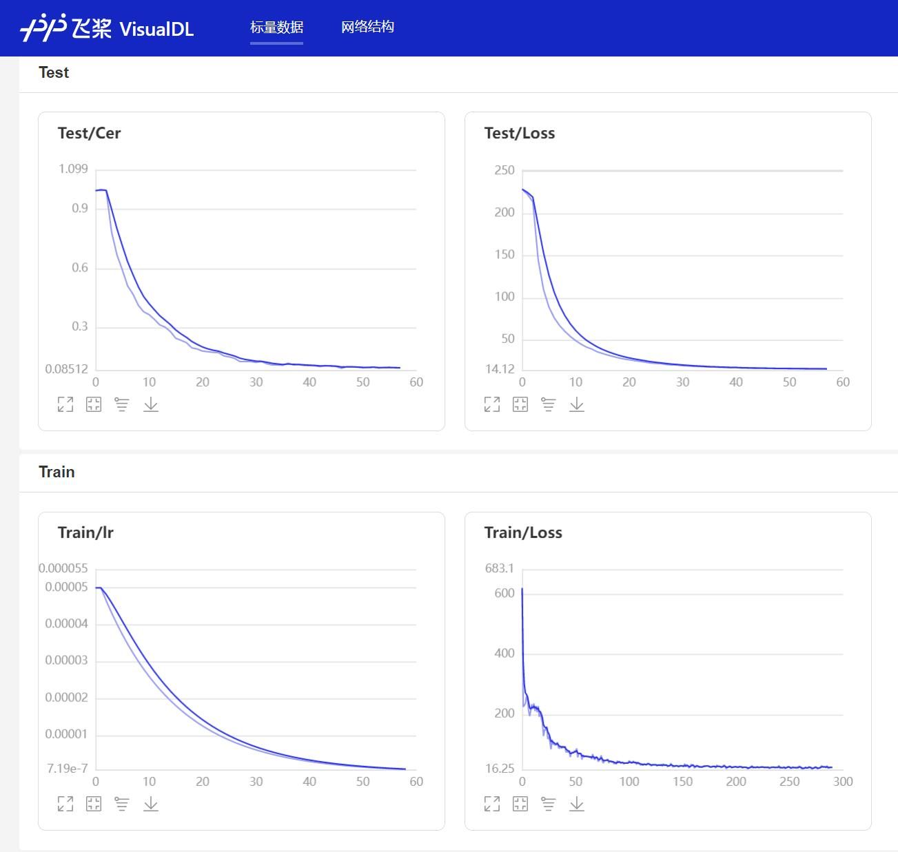

# 训练模型

 - 训练流程，首先是准备数据集，具体看[数据准备](./dataset.md)部分，重点是执行`create_data.py`程序，执行完成之后检查是否在`dataset`目录下生成了`manifest.test`、`manifest.train`、`mean_istd.json`、`vocabulary.txt`这四个文件，并确定里面已经包含数据。然后才能往下执行开始训练。

 - 执行训练脚本，开始训练语音识别模型，详细参数请查看`configs`下的配置文件。每训练一轮和每10000个batch都会保存一次模型，模型保存在`models/<use_model>_<feature_method>/epoch_*/`目录下，默认会使用数据增强训练，如何不想使用数据增强，只需要将参数`augment_conf_path`设置为`None`即可。关于数据增强，请查看[数据增强](./augment.md)部分。如果没有关闭测试，在每一轮训练结果之后，都会执行一次测试计算模型在测试集的准确率，注意为了加快训练速度，训练只能用贪心解码。如果模型文件夹下包含`last_model`文件夹，在训练的时候会自动加载里面的模型，这是为了方便中断训练的之后继续训练，无需手动指定，如果手动指定了`resume_model`参数，则以`resume_model`指定的路径优先加载。如果不是原来的数据集或者模型结构，需要删除`last_model`这个文件夹。
```shell
# 单机单卡训练
CUDA_VISIBLE_DEVICES=0 python train.py
# 单机多卡训练
python -m paddle.distributed.launch --devices=0,1 train.py
```

多机多卡的启动方式：
```shell
# 第一台服务器（主）
python -m paddle.distributed.launch --devices=0,1 --nnodes 2 train.py
```

输出如下：
```
Copy the following command to other nodes to run.
--------------------------------------------------------------------------------
python -m paddle.distributed.launch --master 192.168.4.7:38945 --devices=0,1 --nnodes 2 train.py
--------------------------------------------------------------------------------
```

其他机器执行，上面输出的命令：
```shell
# 第二台服务器
python -m paddle.distributed.launch --master 192.168.4.7:38945 --devices=0,1 --nnodes 2 train.py
```

训练输出结果如下：
```
[2022-10-28 22:55:20.117048 INFO   ] utils:print_arguments:19 - ----------- 额外配置参数 -----------
[2022-10-28 22:55:20.117048 INFO   ] utils:print_arguments:21 - augment_conf_path: configs/augmentation.json
[2022-10-28 22:55:20.117048 INFO   ] utils:print_arguments:21 - configs: configs/conformer_online_zh.yml
[2022-10-28 22:55:20.118051 INFO   ] utils:print_arguments:21 - local_rank: 0
[2022-10-28 22:55:20.118051 INFO   ] utils:print_arguments:21 - pretrained_model: None
[2022-10-28 22:55:20.118051 INFO   ] utils:print_arguments:21 - resume_model: None
[2022-10-28 22:55:20.118051 INFO   ] utils:print_arguments:21 - save_model_path: models/
[2022-10-28 22:55:20.118051 INFO   ] utils:print_arguments:21 - use_gpu: True
[2022-10-28 22:55:20.118051 INFO   ] utils:print_arguments:22 - ------------------------------------------------
[2022-10-28 22:55:20.118051 INFO   ] utils:print_arguments:23 - ----------- 配置文件参数 -----------
[2022-10-28 22:55:20.118051 INFO   ] utils:print_arguments:26 - ctc_beam_search_decoder_conf:
[2022-10-28 22:55:20.118051 INFO   ] utils:print_arguments:28 - 	alpha: 2.2
[2022-10-28 22:55:20.118051 INFO   ] utils:print_arguments:28 - 	beam_size: 300
[2022-10-28 22:55:20.118051 INFO   ] utils:print_arguments:28 - 	beta: 4.3
[2022-10-28 22:55:20.118051 INFO   ] utils:print_arguments:28 - 	cutoff_prob: 0.99
[2022-10-28 22:55:20.118051 INFO   ] utils:print_arguments:28 - 	cutoff_top_n: 40
[2022-10-28 22:55:20.118051 INFO   ] utils:print_arguments:28 - 	language_model_path: lm/zh_giga.no_cna_cmn.prune01244.klm
[2022-10-28 22:55:20.118051 INFO   ] utils:print_arguments:28 - 	num_processes: 10
[2022-10-28 22:55:20.118051 INFO   ] utils:print_arguments:26 - dataset_conf:
[2022-10-28 22:55:20.119061 INFO   ] utils:print_arguments:28 - 	batch_size: 32
[2022-10-28 22:55:20.119061 INFO   ] utils:print_arguments:28 - 	dataset_vocab: dataset/vocabulary.txt
[2022-10-28 22:55:20.119061 INFO   ] utils:print_arguments:28 - 	manifest_type: txt
[2022-10-28 22:55:20.119061 INFO   ] utils:print_arguments:28 - 	max_duration: 20
[2022-10-28 22:55:20.119061 INFO   ] utils:print_arguments:28 - 	mean_istd_path: dataset/mean_istd.json
[2022-10-28 22:55:20.119061 INFO   ] utils:print_arguments:28 - 	min_duration: 0.5
[2022-10-28 22:55:20.119061 INFO   ] utils:print_arguments:28 - 	noise_manifest_path: dataset/manifest.noise
[2022-10-28 22:55:20.119061 INFO   ] utils:print_arguments:28 - 	num_workers: 4
[2022-10-28 22:55:20.132425 INFO   ] utils:print_arguments:28 - 	test_manifest: dataset/manifest.test
[2022-10-28 22:55:20.132425 INFO   ] utils:print_arguments:28 - 	train_manifest: dataset/manifest.train
[2022-10-28 22:55:20.132425 INFO   ] utils:print_arguments:30 - decoder: ctc_beam_search
[2022-10-28 22:55:20.132425 INFO   ] utils:print_arguments:26 - decoder_conf:
[2022-10-28 22:55:20.132425 INFO   ] utils:print_arguments:28 - 	attention_heads: 4
[2022-10-28 22:55:20.132425 INFO   ] utils:print_arguments:28 - 	dropout_rate: 0.1
[2022-10-28 22:55:20.132425 INFO   ] utils:print_arguments:28 - 	linear_units: 2048
[2022-10-28 22:55:20.132425 INFO   ] utils:print_arguments:28 - 	num_blocks: 6
[2022-10-28 22:55:20.132425 INFO   ] utils:print_arguments:28 - 	positional_dropout_rate: 0.1
[2022-10-28 22:55:20.132425 INFO   ] utils:print_arguments:28 - 	self_attention_dropout_rate: 0.0
[2022-10-28 22:55:20.132425 INFO   ] utils:print_arguments:28 - 	src_attention_dropout_rate: 0.0
[2022-10-28 22:55:20.132425 INFO   ] utils:print_arguments:26 - encoder_conf:
[2022-10-28 22:55:20.132425 INFO   ] utils:print_arguments:28 - 	activation_type: swish
[2022-10-28 22:55:20.133421 INFO   ] utils:print_arguments:28 - 	attention_dropout_rate: 0.0
[2022-10-28 22:55:20.133421 INFO   ] utils:print_arguments:28 - 	attention_heads: 4
[2022-10-28 22:55:20.133421 INFO   ] utils:print_arguments:28 - 	cnn_module_kernel: 15
[2022-10-28 22:55:20.133421 INFO   ] utils:print_arguments:28 - 	dropout_rate: 0.1
[2022-10-28 22:55:20.133421 INFO   ] utils:print_arguments:28 - 	input_layer: conv2d
[2022-10-28 22:55:20.133421 INFO   ] utils:print_arguments:28 - 	linear_units: 2048
[2022-10-28 22:55:20.133421 INFO   ] utils:print_arguments:28 - 	normalize_before: True
[2022-10-28 22:55:20.133421 INFO   ] utils:print_arguments:28 - 	num_blocks: 12
[2022-10-28 22:55:20.133421 INFO   ] utils:print_arguments:28 - 	output_size: 256
[2022-10-28 22:55:20.133421 INFO   ] utils:print_arguments:28 - 	pos_enc_layer_type: rel_pos
[2022-10-28 22:55:20.133421 INFO   ] utils:print_arguments:28 - 	positional_dropout_rate: 0.1
[2022-10-28 22:55:20.133421 INFO   ] utils:print_arguments:28 - 	use_cnn_module: True
[2022-10-28 22:55:20.133421 INFO   ] utils:print_arguments:30 - metrics_type: cer
[2022-10-28 22:55:20.133421 INFO   ] utils:print_arguments:26 - model_conf:
[2022-10-28 22:55:20.133421 INFO   ] utils:print_arguments:28 - 	ctc_weight: 0.3
[2022-10-28 22:55:20.133421 INFO   ] utils:print_arguments:28 - 	length_normalized_loss: False
[2022-10-28 22:55:20.133421 INFO   ] utils:print_arguments:28 - 	lsm_weight: 0.1
[2022-10-28 22:55:20.133421 INFO   ] utils:print_arguments:28 - 	reverse_weight: 0.0
[2022-10-28 22:55:20.133421 INFO   ] utils:print_arguments:26 - optimizer_conf:
[2022-10-28 22:55:20.134420 INFO   ] utils:print_arguments:28 - 	learning_rate: 0.001
[2022-10-28 22:55:20.134420 INFO   ] utils:print_arguments:28 - 	warmup_steps: 25000
[2022-10-28 22:55:20.134420 INFO   ] utils:print_arguments:28 - 	weight_decay: 1e-6
[2022-10-28 22:55:20.134420 INFO   ] utils:print_arguments:26 - preprocess_conf:
[2022-10-28 22:55:20.134420 INFO   ] utils:print_arguments:28 - 	feature_method: fbank
[2022-10-28 22:55:20.134420 INFO   ] utils:print_arguments:28 - 	n_mels: 80
[2022-10-28 22:55:20.134420 INFO   ] utils:print_arguments:28 - 	n_mfcc: 40
[2022-10-28 22:55:20.134420 INFO   ] utils:print_arguments:28 - 	sample_rate: 16000
[2022-10-28 22:55:20.134420 INFO   ] utils:print_arguments:28 - 	target_dB: -20
[2022-10-28 22:55:20.134420 INFO   ] utils:print_arguments:28 - 	use_dB_normalization: True
[2022-10-28 22:55:20.134420 INFO   ] utils:print_arguments:26 - train_conf:
[2022-10-28 22:55:20.134420 INFO   ] utils:print_arguments:28 - 	accum_grad: 4
[2022-10-28 22:55:20.134420 INFO   ] utils:print_arguments:28 - 	grad_clip: 5.0
[2022-10-28 22:55:20.134420 INFO   ] utils:print_arguments:28 - 	log_interval: 100
[2022-10-28 22:55:20.134420 INFO   ] utils:print_arguments:28 - 	max_epoch: 100
[2022-10-28 22:55:20.134420 INFO   ] utils:print_arguments:30 - use_model: conformer_online
[2022-10-28 22:55:20.134420 INFO   ] utils:print_arguments:31 - ------------------------------------------------
[2022-10-28 22:55:20.139424 WARNING] augmentation:_parse_pipeline_from:126 - dataset/manifest.noise不存在，已经忽略噪声增强操作！
[2022-10-28 22:55:20.139424 INFO   ] augmentation:_parse_pipeline_from:128 - 数据增强配置：{'type': 'resample', 'aug_type': 'audio', 'params': {'new_sample_rate': [8000, 32000, 44100, 48000]}, 'prob': 0.0}
[2022-10-28 22:55:20.139424 INFO   ] augmentation:_parse_pipeline_from:128 - 数据增强配置：{'type': 'speed', 'aug_type': 'audio', 'params': {'min_speed_rate': 0.9, 'max_speed_rate': 1.1, 'num_rates': 3}, 'prob': 1.0}
[2022-10-28 22:55:20.139424 INFO   ] augmentation:_parse_pipeline_from:128 - 数据增强配置：{'type': 'shift', 'aug_type': 'audio', 'params': {'min_shift_ms': -5, 'max_shift_ms': 5}, 'prob': 1.0}
[2022-10-28 22:55:20.148420 INFO   ] augmentation:_parse_pipeline_from:128 - 数据增强配置：{'type': 'volume', 'aug_type': 'audio', 'params': {'min_gain_dBFS': -15, 'max_gain_dBFS': 15}, 'prob': 1.0}
[2022-10-28 22:55:20.148420 INFO   ] augmentation:_parse_pipeline_from:128 - 数据增强配置：{'type': 'specaug', 'aug_type': 'feature', 'params': {'inplace': True, 'max_time_warp': 5, 'max_t_ratio': 0.05, 'n_freq_masks': 2, 'max_f_ratio': 0.15, 'n_time_masks': 2, 'replace_with_zero': False}, 'prob': 1.0}
............
[2021-09-17 08:41:16.135825] Train epoch: [24/50], batch: [5900/6349], loss: 3.84609, learning rate: 0.00000688, eta: 10:38:40
[2021-09-17 08:41:38.698795] Train epoch: [24/50], batch: [6000/6349], loss: 0.92967, learning rate: 0.00000688, eta: 8:42:11
[2021-09-17 08:42:04.166192] Train epoch: [24/50], batch: [6100/6349], loss: 2.05670, learning rate: 0.00000688, eta: 10:59:51
[2021-09-17 08:42:26.471328] Train epoch: [24/50], batch: [6200/6349], loss: 3.03502, learning rate: 0.00000688, eta: 11:51:28
[2021-09-17 08:42:50.002897] Train epoch: [24/50], batch: [6300/6349], loss: 2.49653, learning rate: 0.00000688, eta: 12:01:30

 ======================================================================
[2021-09-17 08:43:01.954403] Test batch: [0/65], loss: 13.76276, cer: 0.23105
[2021-09-17 08:43:07.817434] Test epoch: 24, time/epoch: 0:24:30.756875, loss: 6.90274, cer: 0.15213
====================================================================== 
```


 - 在训练过程中，程序会使用VisualDL记录训练结果，可以通过在根目录执行以下命令启动VisualDL。
```shell
visualdl --logdir=log --host=0.0.0.0
```

 - 然后再浏览器上访问`http://localhost:8040`可以查看结果显示，如下。

